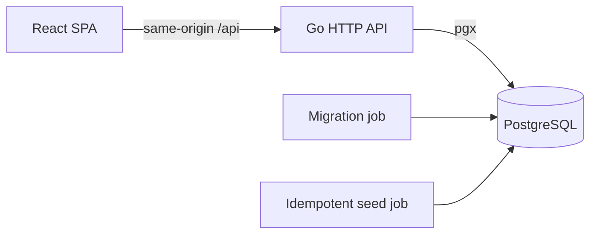

# RFC-001: Vendor Onboarding Tracker

| Metadata | Value |
| --- | --- |
| Status | Draft |
| Owner | Candidate |
| Created | 2026-09-13 |
| Target | Take-home implementation |

## Table of contents

1. [Summary](#summary)
2. [Goals and non-goals](#goals-and-non-goals)
3. [Glossary](#glossary)
4. [Current state](#current-state)
5. [Proposed architecture](#proposed-architecture)
6. [Data model and invariants](#data-model-and-invariants)
7. [API contracts](#api-contracts)
8. [Frontend composition](#frontend-composition)
9. [Security and error handling](#security-and-error-handling)
10. [Requirements and verification](#requirements-and-verification)
11. [Delivery plan](#delivery-plan)
12. [Risks, open questions, and future improvements](#risks-open-questions-and-future-improvements)

## Summary

Replace the manually maintained onboarding spreadsheet with a coordinator-facing SPA backed by an explicit
workflow and an append-only transition history. The service derives elapsed time and stuck state from
server-authored timestamps.

## Goals and non-goals

Goals are a seeded coordinator identity, a useful vendor list, forward stage transitions, attributable history,
and stuck-vendor highlighting. Non-goals are vendor CRUD, account administration, production authentication,
external integrations, deployment infrastructure, and assignment/reassignment.

## Glossary

- **Coordinator:** the authenticated operator using this application.
- **Stage:** one of the five ordered vendor onboarding states.
- **Transition:** an allowed move from the current stage to its immediate successor.
- **Stuck:** a non-Active vendor that has remained in its current stage for more than the configured threshold.

## Current state

The spreadsheet stores only a mutable current value and a manually maintained date. It cannot reliably answer
who changed a stage, reconstruct what happened, validate stage ordering, or highlight stalled vendors.

## Proposed architecture

The repository is a modular monolith. React and Go remain separately buildable but Compose provides a single
startup command. The API owns workflow, time, identity, and transaction rules; the frontend owns presentation.

## Data model and invariants

Phase 2 adds coordinators. Phase 3 adds vendors and immutable history rows. Phase 4 writes current state and
history atomically while holding a row lock. Final ER and state diagrams will be added with those schemas.

## API contracts

Phase 1 exposes `GET /health`, returning `200 {"status":"ok"}` when PostgreSQL responds and `503` otherwise.
Authentication and vendor endpoints are introduced in their owning phases.

## Frontend composition

The frontend applies Atomic Design pragmatically:

- atoms are reusable controls and visual primitives;
- molecules combine primitives into small reusable patterns;
- organisms are page sections such as the vendor table and history panel;
- templates define application and authentication layouts;
- pages own route-level data orchestration.

Feature API/query code stays grouped by domain rather than by visual level.

## Security and error handling

The final local-only authentication uses server-side sessions and an HttpOnly, SameSite cookie. The request body
never supplies the transition actor. HTTP errors use stable codes and do not expose database details. Production
identity, HTTPS termination, and persistent session storage remain explicitly out of scope.

## Requirements and verification

| Requirement | Mechanism | Verification |
| --- | --- | --- |
| Runnable repository | Compose dependency gates and health checks | Clean-volume startup walkthrough |
| API readiness | Database-backed `/health` | Handler test plus live request |
| Frontend foundation | Vite route and Query provider | Lint, typecheck, test, build |
| Safe test isolation | Ephemeral `postgres-test` profile | Integration target leaves app data untouched |

The table expands as each product phase lands.

## Delivery plan

1. Repository and runnable shell.
2. Seeded coordinator login.
3. Vendor dashboard, stuck state, and history view.
4. Transactional stage transition and audit.
5. Documentation and release QA.

Each phase is a reviewable PR-sized change with its own verification gate.

## Risks, open questions, and future improvements

- The three-hour limit requires cutting presentation polish before workflow correctness.
- In-memory sessions intentionally disappear when the API restarts.
- Forward-only transitions cannot correct bad data; a later corrective event should require a reason.
- The first product improvement is assignment/reassignment with an append-only ownership history.
