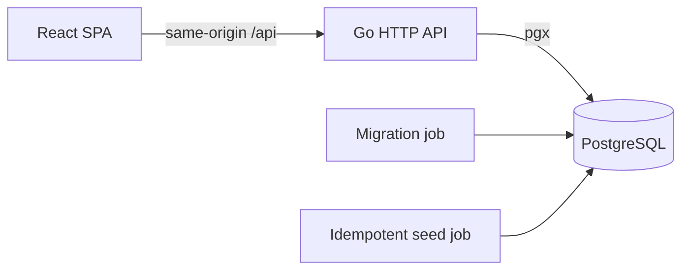
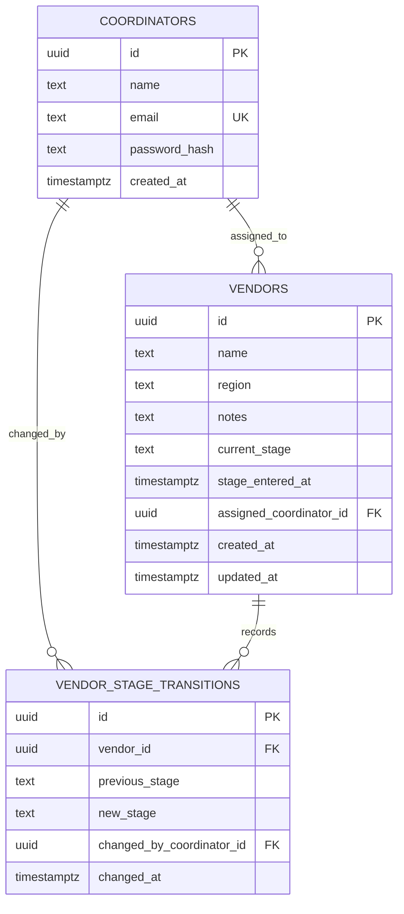
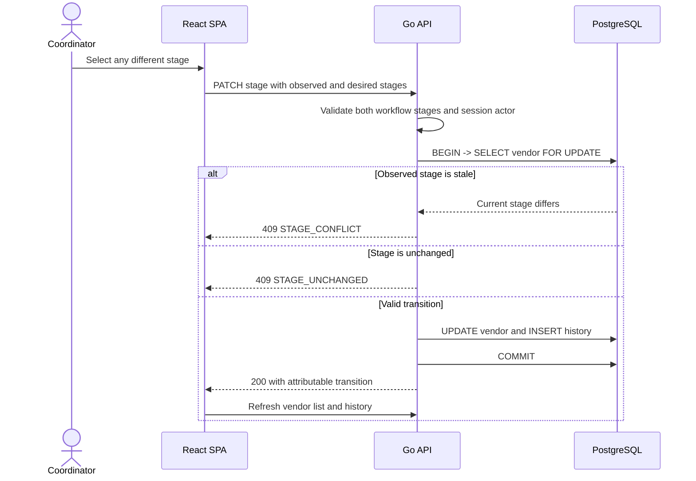

# RFC-001: Vendor Onboarding Tracker

| Metadata | Value |
| --- | --- |
| Status | Implemented |
| Owner | Candidate |
| Created | 2026-09-13 |
| Target | Take-home implementation |

## Table of contents

1. [Summary](#summary)
2. [Goals and non-goals](#goals-and-non-goals)
3. [Glossary](#glossary)
4. [Current state](#current-state)
5. [Proposed architecture](#proposed-architecture)
6. [Data model and invariants](#data-model-and-invariants)
7. [Stage-transition flow](#stage-transition-flow)
8. [API contracts](#api-contracts)
9. [Frontend composition](#frontend-composition)
10. [Security and error handling](#security-and-error-handling)
11. [Requirements and verification](#requirements-and-verification)
12. [Delivery plan](#delivery-plan)
13. [Risks, open questions, and future improvements](#risks-open-questions-and-future-improvements)

## Summary

The implementation replaces the manually maintained onboarding spreadsheet with a coordinator-facing SPA backed
by an explicit workflow and an append-only transition history. The service derives elapsed time and stuck state
from server-authored timestamps.

## Goals and non-goals

Goals are a seeded coordinator identity, a useful vendor list, stage transitions, attributable history,
and stuck-vendor highlighting. Non-goals are vendor CRUD, account administration, production authentication,
external integrations, deployment infrastructure, and assignment/reassignment.

## Glossary

- **Coordinator:** the authenticated operator using this application.
- **Stage:** one of the five ordered vendor onboarding states.
- **Transition:** an allowed move from the current stage to any different workflow stage, including a previous stage.
- **Stuck:** a non-Active vendor that has remained in its current stage for more than the configured threshold.

## Current state

The spreadsheet stores only a mutable current value and a manually maintained date. It cannot reliably answer
who changed a stage, reconstruct what happened, validate stage ordering, or highlight stalled vendors.

## Proposed architecture

The repository is a modular monolith. React and Go remain separately buildable but Compose provides a single
startup command. The API owns workflow, time, identity, and transaction rules; the frontend owns presentation.

## Data model and invariants

Coordinator email is normalized to lowercase before lookup and constrained to lowercase in PostgreSQL. Passwords
are stored as bcrypt hashes. The application validates stage inputs against the five workflow values, while the
database rejects same-stage history records. Backward transitions are permitted and recorded like any other change.
The vendor row is the current-state read model; transition rows form the attributable history. The API writes both
atomically while holding a row lock.

## Stage-transition flow

The observed stage acts as a lightweight version. Locking the vendor row prevents two coordinators from both
committing based on the same stale state: one succeeds and the other receives `STAGE_CONFLICT`. The update and audit
insert share one transaction, so either both persist or neither does. An identical retry after a successful but
ambiguous response receives a conflict and cannot create a duplicate history row. `next_stage` remains an
informational progression hint; it does not limit the desired stage.

## API contracts

| Endpoint | Contract |
| --- | --- |
| `GET /health` | `200 {"status":"ok"}` when PostgreSQL responds; otherwise `503` |
| `POST /api/v1/auth/login` | `{email,password}` → coordinator plus an HttpOnly session cookie |
| `GET /api/v1/auth/me` | Current coordinator; `401 UNAUTHENTICATED` without a valid session |
| `POST /api/v1/auth/logout` | Idempotently invalidate the session, expire the cookie, and return `204` |
| `GET /api/v1/vendors` | All vendors with server-derived elapsed hours, stuck state, and expected next stage |
| `GET /api/v1/vendors/{id}/history` | Reverse-chronological, attributable stage transitions; `404 VENDOR_NOT_FOUND` for an unknown ID |
| `PATCH /api/v1/vendors/{id}/stage` | `{expected_current_stage,new_stage}` → attributable transition; any different valid stage is allowed |

Stage updates reject malformed input with `400 INVALID_REQUEST`, unknown workflow stages with `422 INVALID_STAGE`,
unchanged stages with `409 STAGE_UNCHANGED`, stale writes with `409 STAGE_CONFLICT`, and unknown vendors with
`404 VENDOR_NOT_FOUND`.

## Frontend composition

The frontend applies Atomic Design pragmatically:

- atoms are reusable controls and visual primitives;
- molecules combine primitives into small reusable patterns;
- organisms are page sections such as the vendor table and history panel;
- templates define application and authentication layouts;
- pages own route-level data orchestration.

Feature API/query code stays grouped by domain rather than by visual level.

## Security and error handling

Local-only authentication uses bcrypt verification and crypto-random, eight-hour server-side sessions protected by
a mutex. The browser receives only an HttpOnly, SameSite=Lax cookie. The request body never supplies identity.
HTTP errors use stable codes and do not expose database details. Restarting the API invalidates sessions;
production identity, HTTPS termination, CSRF hardening beyond SameSite, rate limiting, and persistent session
storage remain explicitly out of scope.

## Requirements and verification

| Requirement | Mechanism | Verification |
| --- | --- | --- |
| Runnable repository | Compose dependency gates and health checks | Clean-volume startup walkthrough |
| API readiness | Database-backed `/health` | Handler test plus live request |
| Frontend foundation | Vite route and Query provider | Lint, typecheck, test, build |
| Safe test isolation | Ephemeral `postgres-test` profile | Integration target leaves app data untouched |
| Seeded coordinator identity | Bcrypt seed plus server session | Login/service and live HTTP flow |
| Protected routes | `/me` is the auth source of truth | Missing/expired session and route-guard tests |
| Logout | Delete server session and clear Query cache | Old-cookie API test and navigation test |
| Vendor visibility | Authenticated list over six durable fixtures | Live seed query and HTTP contract test |
| Stuck detection | Server clock and configured strict threshold | 167h/168h/169h plus old-Active unit cases |
| Attention-first list order | Stuck first, then longest wait, then name | Ordering unit test over mixed fixtures |
| Vendor history | Indexed append-only records with server-authored actor/time fields | History HTTP contract and direct-route UI test |
| Stage correction | Any different known stage, including an earlier stage | Service, HTTP, and UI backward-transition tests |
| Atomic audit | Row lock plus vendor update and history insert in one transaction | Rollback integration test |
| Concurrent edits | Client-observed stage checked after row locking | Concurrent integration test with one winner |
| Coordinator ownership view | Client-side All/Assigned-to-me filter | Dashboard render/filter test |
| Recoverable direct URL | Resolve selected vendor from the cached list | Unknown-ID UI test |

The verification choices prioritize identity, time boundaries, audit atomicity, and concurrent edits because those
are the spreadsheet replacement's highest-risk behaviors.

## Delivery plan

| Phase | Deliverable | Status |
| --- | --- | --- |
| 1 | Repository and runnable shell | Complete |
| 2 | Seeded coordinator login | Complete |
| 3 | Vendor dashboard, stuck state, and history view | Complete |
| 4 | Transactional stage transition and audit | Complete |
| 5 | Documentation and release QA | Complete |

Each phase was delivered as a reviewable PR-sized change with its own verification gate. Run and test commands are
kept in the [README](../README.md) so this RFC remains focused on design decisions.

## Risks, open questions, and future improvements

- The three-hour limit requires cutting presentation polish before workflow correctness.
- In-memory sessions intentionally disappear when the API restarts.
- Allowing backward transitions supports corrections but can also permit accidental regression; a production
  workflow could require confirmation or a reason when moving backward.
- The stage value is the concurrency token. A future API could use a dedicated version and idempotency key to replay
  the original success response instead of returning a conflict after an ambiguous retry.
- The first product improvement is assignment/reassignment with an append-only ownership history.
